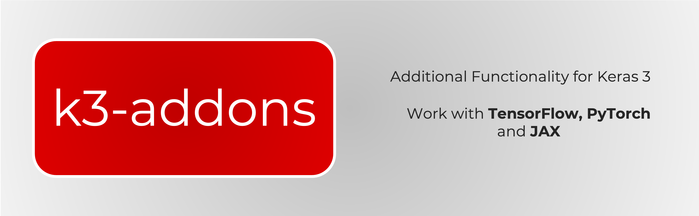

# k3-addons: Additional multi-backend functionality for Keras 3.


# Installation

```bash
pip install k3-addons
```

# Includes:
- ## Layers
- ### Pooling:
    - `k3_addons.layers.AdaptiveAveragePooling1D`
    - `k3_addons.layers.AdaptiveMaxPooling1D`
    - `k3_addons.layers.AdaptiveAveragePooling2D`
    - `k3_addons.layers.AdaptiveMaxPooling2D`
    - `k3_addons.layers.Maxout`

- #### Normalization
    - `k3_addons.layers.InstanceNormalization`
- #### Attention:
    - `k3_addons.layers.DoubleAttention`
    - `k3_addons.layers.AFTFull`
    - `k3_addons.layers.ChannelAttention2D`
    - `k3_addons.layers.SpatialAttention2D`
    - `k3_addons.layers.ECAAttention`
    - `k3_addons.layers.ExternalAttention`
    - `k3_addons.layers.ResidualAttention`
    - `k3_addons.layers.MobileViTAttention`
    - `k3_addons.layers.BAMBlock`
    - `k3_addons.layers.CBAM`
    - `k3_addons.layers.MobileViTAttention`
    - `k3_addons.layers.MobileViTv2Attention`
    - `k3_addons.layers.ParNetAttention`
    - `k3_addons.layers.SimAM`

- ## Losses
    - `k3_addons.losses.ContrastiveLoss`
    - `k3_addons.losses.GIoULoss`
    - `k3_addons.losses.PinballLoss`
    - `k3_addons.losses.SigmoidFocalCrossEntropy`
    - `k3_addons.losses.WeightedKappaLoss`
    - `k3_addons.losses.pairwise_distance`
    - `k3_addons.losses.pinball_loss`

- ## Activations

    -  `k3_addons.activations.hardshrink`
    - `k3_addons.activations.lisht`
    - `k3_addons.activations.mish`
    - `k3_addons.activations.snake`
    - `k3_addons.activations.tanhshrink`
